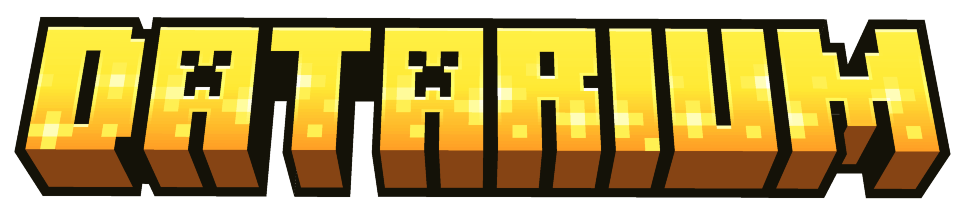
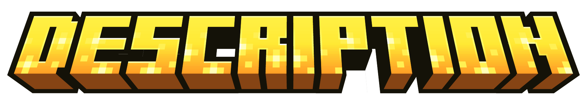

### **English 🇺🇸** / [**Русский 🇷🇺**](README_ru.md)

<h1 align="center">
An unified mod planned to support modern resourcepacks/datapacks back on 1.12.2.
</h1>

> [!IMPORTANT]
> **This mod can be launched only on Cleanroom!** 
> 
> You can see how to install it [here.](https://cleanroommc.com/wiki/end-user-guide/installation/install-client)

> [!IMPORTANT]
> **This mod is currently in beta state.**
>
> That means you can download the latest build [here](https://github.com/TheSlize/Datarium/releases/latest) (or CF/Modrinth) but expect features being underdeveloped or bugged.

Datarium is meant to backport resource-/data- packs support from 1.20-1.21 versions back on 1.12.2. That means having Datarium in your modpack makes you able to just drag-n-drop any of your favorite packs from modern versions, load them and they'll work just fine.

And supporting 'any' packs means supporting those even if they require certain mods to boot properly (e.g. Optifine or CIT Resewn).

## List of features/mod replacements:
1. **CIT Resewn/Optifine's CIT** (finished)
2. **Modern model definitions** (1.20.1 and 1.21.11 variants) (WIP)
3. **Custom Entity Models** (finished)
4. **Modern font/main menu background support** (finished)
5. **RespackOpts functionality** (finished)
6. **Custom Entity Textures** (finished)
7. **Datapack support** (1.20.1 variant) (planned)
8. **Other mods' support** (considering 1.12 doesn't have certain items/blocks, e.g. netherite tools, autosupport FutureMC's and it's analogues ones) (planned)

# FAQ

**Q:** When do you plan to finish all the work?

**A:** I don't know, honestly. Considering this is not an only project I'm currently working on, I'm not even sure when I'll be able to actively develop it again.
Hopefully I'll be able to finish most of the work by the end of 2026.

**Q:** Do you plan on adding similar to CTM/Fusion support?

**A:** No. Maybe after the actual release but definitely not now.

**Q:** How can we help you with development?

**A:** Two ways. Either find bugs / find what's underdeveloped and report it [here](https://github.com/TheSlize/Datarium/issues) or make a fork, code the desired api/feature from **list of features** and make a [pull request.](https://github.com/TheSlize/Datarium/pulls) Any of these actions would be heavily appreciated.

**Q:** Why not make your mod on Forge instead of Cleanroom?

**A:** 1.12 has enough limitations and rendering quirks already. I don't want Java itself to be the limitation. Also I believe that Cleanroom is the future for 1.12.2.

**Q:** Was AI used to make the mod? If yes - why?

**A:** Yes. Though I use AI as an **instrument**, not as my **replacement**. That's important to know. Believe me, AI tends to hallucinate and do quite stupid mistakes, and if I were that bad at coding just because of AI usage that mod wouldn't ever come out.

# License and credits

The code of Datarium is licensed under the [GNU Lesser General Public License v3.0](LICENSE) (the GPL v3 text it builds on is in [licenses/GPL-3.0.txt](licenses/GPL-3.0.txt)). The bundled Minecraft assets are not covered by it, see below.

- The Custom Entity Textures implementation is a 1.12.2 port of [Entity Texture Features](https://github.com/Traben-0/Entity_Texture_Features) by Traben (LGPL-3.0).
- The Custom Entity Models animation API is modelled on [Entity Model Features](https://github.com/Traben-0/Entity_Model_Features) by Traben (LGPL-3.0).
- The CIT feature reads the formats of [CIT Resewn](https://github.com/SHsuperCM/CITResewn) by SHsuperCM (MIT) and OptiFine; note that none of their verbatim code is included.
- The pack options feature reads the format of [Respackopts](https://git.frohnmeyer-wds.de/JfMods/Respackopts) by JFronny (GPL-3.0, formerly MIT); note that none of its verbatim code is included.
- The configure button texture is the unmodified one from [Mod Menu](https://github.com/TerraformersMC/ModMenu) by Prospector ([MIT](licenses/MIT.txt)).
- The project skeleton comes from kappa-maintainer's Cleanroom template ([MIT](licenses/MIT.txt)).
- The villager, zombie villager, horse and iron golem textures and the font textures and definitions are original or adapted Minecraft assets, copyright Mojang AB / Microsoft. They are included only so that resource packs written for newer versions of the game render correctly on 1.12.2. They are not licensed under the LGPL or GPL and remain subject to the [Minecraft EULA](https://www.minecraft.net/eula) and Usage Guidelines.

Datarium is not an official Minecraft product and is not approved by or associated with Mojang or Microsoft.

See [NOTICE](NOTICE) for details.