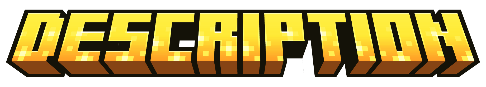

### [**English 🇺🇸**](README.md) / **Русский 🇷🇺**

<h1 align="center">
Единый мод для поддержки современных ресурспаков и датапаков на 1.12.2.
</h1>

> [!IMPORTANT]
> **Этот мод можно запустить только через Cleanroom!**
>
> Вы можете посмотреть инструкцию по установке [здесь.](https://cleanroommc.com/wiki/end-user-guide/installation/install-client)

> [!IMPORTANT]
> **На данный момент мод находится в состоянии альфы.**
>
> Это значит, что последний билд можно скачать [здесь,](https://github.com/TheSlize/Datarium.git/releases/latest) но ожидайте баги и недоработанные/несделанные фичи.

Datarium создан, чтобы поддерживать любые ресурс-/дата- паки с версий 1.20-1.21 прямиком на 1.12.2. Это значит, что с Datarium-ом в сборке можно просто перетащить любой любимый архив с паком на 1.12, загрузить его, и он будет исправно работать.

Под поддержкой 'любых' паков имеется в виду поддержка даже тех паков, которые требуют некоторых модов для корректной работы (например Optifine или CIT Resewn).

## Список фич/модов для замены:
1. **CIT Resewn/CIT из Optifine** (завершено примерно на 95%, может иметь баги)
2. **Современная система моделей предметов/блоков** (варианты с 1.20.1 и 1.21.11) (WIP)
3. **Custom Entity Models** (WIP)
4. **Поддержка современных шрифтов/фонов в меню** (завершено)
5. **Функционал из RespackOpts** (завершено)
6. **Custom Entity Textures** (в планах)
7. **Поддержка датапаков** (вариант с 1.20.1) (в планах)
8. **Поддержка иных модов** (учитывая, что на 1.12 нет некоторых предметов/блоков, допустим, незеритовых инструментов - автозамена их на инструменты из FutureMC's или его аналогов) (в планах)

# FAQ

**Q:** Когда вы планируете завершить работу над модом?

**A:** Честно, не знаю. Учитывая, что это далеко не единственный проект, над которым я работаю, я даже не уверен, когда я смогу вернуться к его активной разработке. Даже лого в верху README не является финальной версией, лол.
Надеюсь, смогу завершить мод к концу 2026-го года.

**Q:** Планируете ли добавлять поддержку соединяемых текстур, чего-то сродни CTM-а или Fusion-а?

**A:** Нет.

**Q:** Почему не выпустить бы мод на Курсфордже/Модринфе?

**A:** Я не могу назвать свой мод и близко завершённым, чтобы выпустить на курс/модринф хотя бы в состояние беты. Буквально 90% содержания из описания было б "мод должен/планирует поддерживать". Однако, если будет достаточно подобных запросов, я могу его всё же выложить на обе площадки.

**Q:** Как мы можем помочь вам с разработкой?

**A:** Два пути. Либо поищите баги / недоработки в фичах и сделайте соответственный(ые) репорт(ы) [вот тут](https://github.com/TheSlize/Datarium/issues), либо сделайте форк, накодьте из **списка фич** то, что вы хотите сделать/доделать и сделайте [пулл-реквест.](https://github.com/TheSlize/Datarium/pulls) Буду признателен за любое из этих двух действий.

**Q:** Почему не сделать мод на Forge вместо Cleanroom-а?

**A:** У 1.12 и так достаточно ограничений и откровенных странностей в api рендера. Не хочу, чтобы сама Java была этим ограничением из-за старой версии. Также я верю, что для 1.12.2 будущее за Cleanroom-ом.